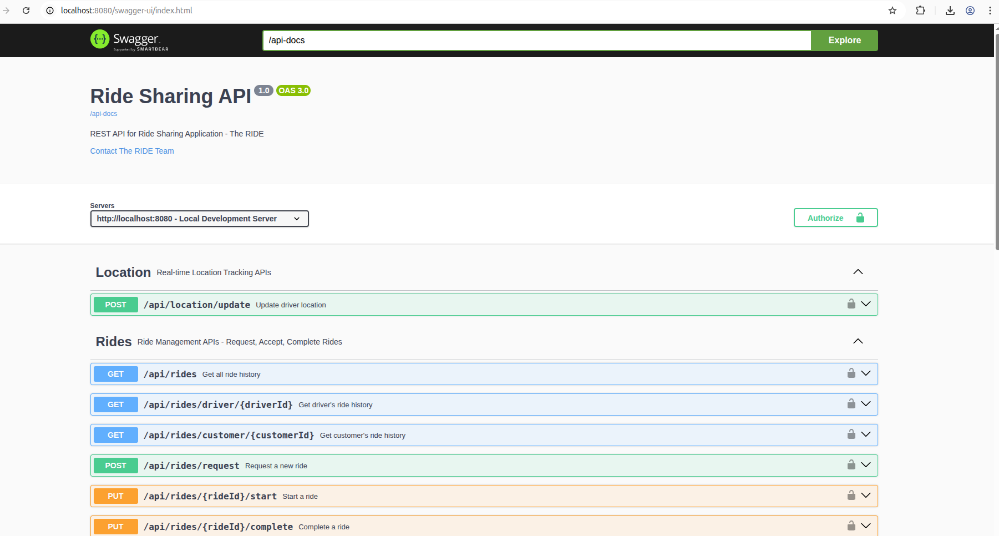
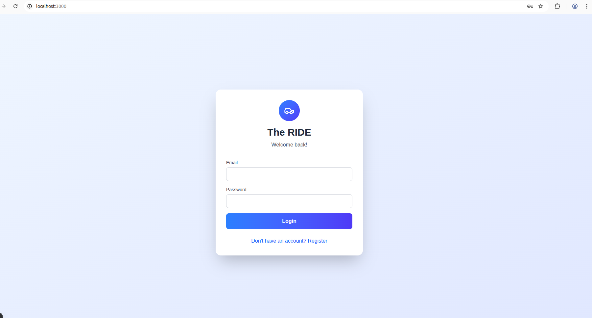

# How to Run Ride Sharing System

## Architecture


## Prerequisites

- Java 21
- Node.js 20 or higher installed
- PostgreSQL 13
- Docker
- Docker Compose
- Maven
- NextJs
---

## Running the Backend (Spring Boot)

### Database Configuration

Configure PostgreSQL in `application-dev.yml`:

```properties
server:
  port: 8080

spring:
  datasource:
    url: jdbc:postgresql://localhost:5432/ridesharing
    username: wilfred
    password: wiliy8615.
  jpa:
    hibernate:
      ddl-auto: update
    show-sql: true
    properties:
      hibernate:
        dialect: org.hibernate.dialect.PostgreSQLDialect

  data:
    redis:
      host: localhost
      port: 6379

jwt:
  secret: Z2F0ZXdheWFwaTIwMjVXeXpRbU1jRGd6b1RYaEZ0Q0hYeXRCeGdRYkZvTnFRVmRZemlKT2p3a1NwRFRkTHg1Ug
  expiration: 900000

springdoc:
  api-docs:
    path: /api-docs
  swagger-ui:
    path: /swagger-ui.html
    operationsSorter: method
management:
  endpoints:
    web:
      exposure:
        include: "*"
```

### Option 1: Using Maven Wrapper (Recommended)

1. Open terminal/command prompt
2. Navigate to your Spring Boot project directory
   ```bash
   cd path/to/backend
   ```
3. Run the application:
   - **Mac/Linux:** `./mvnw spring-boot:run` or `mvn spring-boot:run`
   - **Windows:** `mvnw.cmd spring-boot:run` or `mvn spring-boot:run`
4. Wait for the application to start (you'll see "Started Application in X seconds")
5. Backend is now running at `http://localhost:8080`

### Swagger UI Output

- Open in your favourite browser: [**Local Swagger UI**](http://localhost:8080/swagger-ui/index.html)
- Open in your favourite browser: [**Demo Swagger UI**](http://localhost:8083/swagger-ui/index.html)

**Expected Output:**



---

## Backend Uptime

### Swagger UI Output

- Open the ping: [**Ping**](http://localhost:8080/ping)
- Open the actuator: [**Actuator**](http://localhost:8080/actuator/health)


## Running the Frontend (Next.js)

### Frontend Configuration

Create `.env.local` file in frontend root directory:

```
NEXT_PUBLIC_API_URL=http://localhost:8080
```

### Development Mode

1. Open a new terminal/command prompt (keep backend terminal running)
2. Navigate to your Next.js project directory
   ```bash
   cd path/to/frontend
   ```
3. Install dependencies (first time only):
   ```bash
   npm install
   ```
4. Start the development server:
   ```bash
   npm run dev
   ```
5. Wait for compilation to complete
6. Frontend is now running at `http://localhost:3000`

### Frontend Output

Once frontend is running, navigate to [**Local Swagger UI**](http://localhost:3000/)
Once frontend is running, navigate to [**Demo Swagger UI**](http://localhost:8076/)

**Expected Output:**



---

## Redis CLI

You can access and inspect Redis data using the command-line interface.

### 1. Connect to Redis

```bash
redis-cli -h 127.0.0.1 -p 6379 -a redispass
```

### 2. List All Keys
```bash
KEYS *
```

### 3. Check Driver Location
```bash
GEOPOS driver:locations <driverId>
```

## Ride-Sharing App Seed Users

This file lists the initial seed users for the Ride-Sharing app database with their login credentials and roles.

| Role       | Email (Username)            | Password        |
|-----------|----------------------------|----------------|
| ADMIN     | admin@ridesharingapp.com    | Admin@123      |
| DRIVER    | driver1@ridesharingapp.com  | Driver1@123    |
| DRIVER    | driver2@ridesharingapp.com  | Driver2@123    |
| CUSTOMER  | customer1@example.com       | Customer1@123  |
| CUSTOMER  | customer2@example.com       | Customer2@123  |

## Disclaimer

The current implementation does not fully match the architecture/design diagram due to time constraints. Some features or flows may differ from the design, e.g., **Kafka and notification service are missing**.
